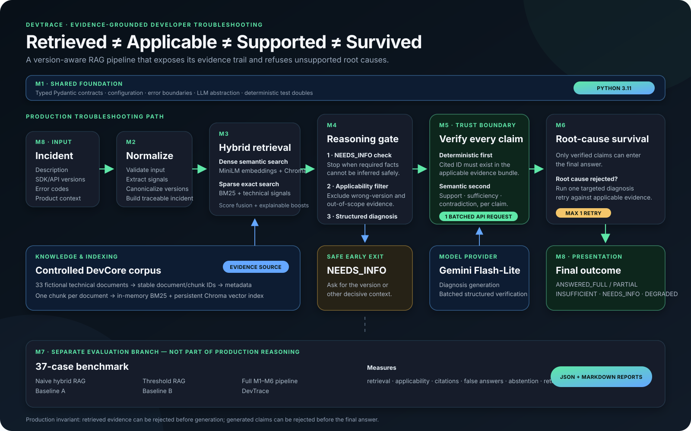

# DevTrace

**Evidence-grounded, version-aware troubleshooting for developer incidents.**

DevTrace accepts a technical incident, retrieves candidate documentation with hybrid search, removes evidence that does not apply to the reported software version, generates a structured diagnosis, and independently verifies every claim before it can reach the final answer.

Its central invariant is:

```text
RETRIEVED ≠ APPLICABLE ≠ SUPPORTED ≠ SURVIVED
```

That distinction is the project. Finding a relevant document is not proof that it applies to the user's version; including an applicable document in a prompt is not proof that the model used it faithfully; and verifying a secondary claim is not enough for a root cause to survive.

## Problem statement

Developer documentation often contains several plausible solutions for the same symptom:

- an error code can mean different things across major SDK versions;
- semantic retrieval can rank old and current documentation together;
- a generated answer can cite a real chunk without that chunk supporting the claim;
- a confident answer can be worse than a safe request for missing information;
- unconstrained agent retries can increase latency and cost without improving reliability.

A conventional RAG pipeline usually treats retrieval relevance as permission to answer. That is unsafe for version-sensitive troubleshooting. For example, `AUTH_401` documentation for DevCore SDK 2.x recommends raw API-key authentication, while SDK 3.x requires OAuth 2.0 Bearer tokens. Both documents are semantically relevant, but only one is applicable to a 3.1 incident.

## What DevTrace does

DevTrace turns an incident into one of five explicit outcomes:

| Outcome | Meaning |
|---|---|
| `ANSWERED_FULL` | The root cause and all answer claims survived verification. |
| `ANSWERED_PARTIAL` | The root cause survived, but one or more secondary claims did not. |
| `NEEDS_INFO` | A decisive fact such as the SDK version is missing. |
| `INSUFFICIENT_EVIDENCE` | The available knowledge cannot support a root cause. |
| `DEGRADED` | A system or provider error prevented safe completion. |

The Streamlit application exposes the final answer together with the retrieval trace, applicability decisions, per-claim verification verdicts, retry behavior, and underlying evidence.

## Architecture

The diagram below is the canonical project architecture and the same asset intended for presentations and Loom walkthroughs.



The production path is:

1. **M1 — Shared foundation:** Pydantic contracts, configuration, errors, outcome types, and LLM interfaces.
2. **M2 — Normalize:** validate the incident and extract versions, products, error codes, and technical signals.
3. **M3 — Retrieve:** combine dense semantic search with BM25 exact-term search, then fuse and boost the rankings.
4. **M4 — Gate and diagnose:** request missing decisive information, reject wrong-version/out-of-scope evidence, and generate structured root-cause, fix, and explanation claims.
5. **M5 — Verify:** deterministically validate citation IDs, then semantically check support, sufficiency, and contradiction for every citation-valid claim.
6. **M6 — Survive and retry:** require a verified root cause; when allowed, perform at most one targeted retry.
7. **M8 — Present:** render outcomes, claims, evidence, filtering decisions, and the pipeline audit trail without performing new reasoning.

**M7 is deliberately separate from production reasoning.** It compares Naive RAG, Threshold RAG, and the full DevTrace pipeline using a controlled evaluation dataset.

## Important design choices

### Applicability is evaluated before generation

M4 receives retrieved candidates but passes only applicable evidence to diagnosis and verification. Wrong-version documents can remain visible in the audit trail while being structurally prevented from influencing the answer.

### Citation validity is deterministic

Before semantic verification, M5 checks that every cited chunk ID exists in the applicable evidence bundle. Missing, invented, or previously excluded citations are rejected without an LLM call.

### Semantic verification remains per claim

Each claim receives its own verdict, support decision, contradiction decision, reason, and supporting evidence IDs. For live Gemini operation, the citation-valid claims are bundled into one structured API request. The response must contain exactly one result for every expected claim ID—missing, duplicated, or unexpected IDs fail validation.

This reduces a typical successful execution from approximately one diagnosis call plus one provider call per claim to:

```text
1 diagnosis request + 1 batched verification request = 2 Gemini requests
```

### Root-cause survival is stricter than claim verification

A verified fix or explanation cannot rescue an unverified root cause. M6 assembles an answer only when the root-cause claim survives M5.

### Retry is bounded

M6 permits at most one targeted retry and only when applicable evidence remains. The retry prompt includes the rejected claims and verifier feedback; a second retry is structurally impossible.

### Evaluation cannot alter production reasoning

Gold document IDs and expected labels are used only after a run for metric calculation. They are never injected into retrieval, diagnosis, verification, or retry prompts.

### Provider failures are explicit

Gemini requests default to a 45-second timeout, SDK-level long retries are disabled, and HTTP 429 errors are converted to concise, actionable `DEGRADED` errors. The UI does not silently treat execution failures as safe abstentions.

## Unique strengths

- **Version-conflict protection:** relevant but incompatible documents are explicitly excluded.
- **Hybrid retrieval:** dense similarity handles paraphrases while BM25 preserves exact error codes and technical identifiers.
- **Evidence-level observability:** users can see what was retrieved, filtered, cited, verified, contradicted, and retained.
- **Claim-level grounding:** an answer is assembled from surviving claims rather than unverified generated prose.
- **Safe early exits:** ambiguity, unsupported questions, and system errors have distinct outcomes.
- **Bounded recovery:** one targeted retry improves recoverability without creating an uncontrolled loop.
- **Reproducible evaluation:** deterministic fixtures exercise the real M1–M6 contracts and produce JSON and Markdown artifacts.
- **Provider-efficient verification:** live M5 preserves independent verdicts while using one batched model request.

## Technology stack

| Area | Technology | Role |
|---|---|---|
| Runtime | Python 3.11 | Application and evaluation runtime |
| Contracts/configuration | Pydantic 2, pydantic-settings | Typed boundaries and environment-based configuration |
| Dense retrieval | Sentence Transformers `all-MiniLM-L6-v2` | Local semantic embeddings |
| Vector store | ChromaDB | Persistent cosine-similarity index |
| Sparse retrieval | `rank-bm25` | Exact technical-term and error-code retrieval |
| Generation/verification | Gemini 3.5 Flash-Lite | Structured diagnosis and batched semantic verification |
| UI | Streamlit | Interactive diagnosis, evidence trace, evaluation, and architecture views |
| Testing | pytest | Offline unit, contract, orchestration, evaluation, and UI-helper tests |

DevTrace implements its pipeline with explicit Python modules and typed contracts. It does not depend on LangChain or LangGraph; this keeps applicability, verification, and retry rules directly inspectable and testable.

## Repository layout

```text
DevTrace/
├── app.py                          # Streamlit entry point
├── docs/
│   └── devtrace-architecture.svg   # Canonical README/Loom architecture diagram
├── data/
│   ├── corpus/                     # 33-document fictional DevCore corpus
│   ├── eval/                       # 37 controlled evaluation cases
│   └── eval_results/               # Generated JSON and Markdown reports
├── src/
│   ├── ingestion/                  # Corpus loading and stable evidence chunks
│   ├── normalization/              # Incident and signal normalization
│   ├── retrieval/                  # Dense, BM25, fusion, boosts, Chroma index
│   ├── diagnosis/                  # NEEDS_INFO gate and structured generation
│   ├── verification/               # Citation and semantic claim verification
│   ├── orchestration/              # Survival, answer assembly, one retry
│   ├── m7/                         # Baselines, evaluation, metrics, reports
│   ├── m8/                         # Streamlit application and render helpers
│   ├── llm/                        # Gemini and deterministic fake clients
│   └── models/                     # Shared contracts and enums
└── tests/unit/                     # 456 deterministic tests
```

## Setup

The verified development runtime is **Python 3.11.9**.

### Windows PowerShell

```powershell
git clone https://github.com/Hari-GenAcad/DevTrace.git
Set-Location DevTrace

py -3.11 -m venv venv
.\venv\Scripts\Activate.ps1
python -m pip install --upgrade pip
python -m pip install -r requirements.txt

Copy-Item .env.example .env
```

Open `.env` and add a Gemini API key for live mode:

```dotenv
GEMINI_API_KEY=your_key_here
GEMINI_MODEL=gemini-3.5-flash-lite
GEMINI_TEMPERATURE=0
GEMINI_TIMEOUT_SECONDS=45
DEVTRACE_ENV=development
```

`.env` is ignored by Git. Never commit API keys.

The first dense-retrieval run may download `sentence-transformers/all-MiniLM-L6-v2` from Hugging Face. Later runs use the local model cache.

## Run the application

With the virtual environment active:

```powershell
streamlit run app.py
```

Open `http://localhost:8501`.

The UI offers three model modes:

- **Auto:** use Gemini when a key is configured; otherwise use the deterministic fake client.
- **Fake LLM:** exercise the safety path and presentation without external API usage. It is not a quality benchmark.
- **Live Gemini:** require and use the configured Gemini key.

## Two recommended live demonstrations

These are the recommended examples for manual testing and the Loom walkthrough.

### 1. Straightforward rate-limit diagnosis

| Field | Value |
|---|---|
| Incident Description | `Our integration keeps getting RATE_429 errors during batch processing jobs. Several application instances share the same OAuth client credentials, and the errors become more frequent when the batch workers start at the same time. How should we handle the rate limiting?` |
| Current Version | `3.1` |
| Previous Version | Leave blank |
| Error Codes | `RATE_429` |
| Product / Component | `DevCore API` |

Expected behavior:

- `ANSWERED_FULL` or, depending on model phrasing, `ANSWERED_PARTIAL`;
- root cause involving shared credentials, combined request counts, or burst limits;
- fixes grounded in applicable evidence, such as `Retry-After`, exponential backoff, startup jitter, separate credentials, local throttling, or bulk endpoints;
- valid per-claim verification results;
- normally no retry because the initial root cause survives.

### 2. Version-conflict demonstration

| Field | Value |
|---|---|
| Incident Description | `After upgrading our DevCore SDK from version 2.8 to 3.1, every API request started returning AUTH_401. The application still sends the header as 'Authorization: ApiKey <key>'. We confirmed that the API key itself has not expired. What changed, and how should we update the authentication flow?` |
| Current Version | `3.1` |
| Previous Version | `2.8` |
| Error Codes | `AUTH_401` |
| Product / Component | `DevCore SDK` |

Expected behavior:

- the answer explains the SDK 3.x move from raw API keys to OAuth 2.0 Bearer tokens;
- `AUTH-002` or other applicable SDK 3.x evidence supports the diagnosis;
- highly relevant SDK 2.x documents such as `AUTH-001` and `AUTH-005` may be retrieved but must be excluded by M4;
- excluded evidence must not be cited in the final answer;
- the fix removes `Authorization: ApiKey ...`, provisions OAuth client credentials, and sends `Authorization: Bearer <token>`.

This second example demonstrates the core thesis: **retrieval relevance does not imply version applicability**.

## Run the tests

```powershell
python -m pytest -q
```

Current verified result:

```text
456 passed
```

The retrieval tests load the local embedding model and can take longer on a cold cache.

## Run the evaluation

### Deterministic controlled evaluation

```powershell
python -m src.m7.runner
```

This runs all three systems—Naive RAG, Threshold RAG, and DevTrace—against controlled, case-specific fake-model responses while exercising the production contracts.

### Live Gemini evaluation

Live mode uses the configured API and may incur usage or quota consumption:

```powershell
$env:DEVTRACE_EVAL_MODE = "live"
python -m src.m7.runner
```

Reports are written to:

- [`data/eval_results/evaluation_results.json`](data/eval_results/evaluation_results.json)
- [`data/eval_results/evaluation_report.md`](data/eval_results/evaluation_report.md)

## Latest controlled evaluation snapshot

The committed deterministic report contains 37 cases:

| Metric | Result |
|---|---:|
| Retrieval hit rate | 100.0% |
| Citation validity | 100.0% |
| Citation correctness proxy | 100.0% |
| DevTrace false-answer rate | 0.0% |
| DevTrace false-abstention rate | 16.7% |
| Correct version-conflict exclusion | 100.0% |
| Retry recovery | 75.0% (3 of 4) |
| Degraded cases | 0 |

These numbers demonstrate deterministic contract behavior, not independent live-model quality. The corpus and benchmark were authored for this project, and the fake responses are controlled fixtures. Claims about real model quality require a separately identified live evaluation.

Also note that a high forbidden-document **retrieval** rate is not itself a failure in DevTrace: the architecture expects retrieval to be broad. The key safety measurement is whether M4 excludes incompatible evidence before diagnosis and whether M5 prevents unsupported claims from surviving.

## Reproducible five-minute walkthrough

1. Start the UI and select **Auto** or **Live Gemini**.
2. Run the version-conflict input above.
3. Show the final answer and the `AUTH_401` authentication change.
4. Open **Pipeline trace** to explain retrieval, applicability, verification, and survival.
5. Open **Evidence trail** and contrast applicable SDK 3.x evidence with excluded SDK 2.x evidence.
6. Run the rate-limit input to demonstrate the straightforward full-answer path.
7. Open **Evaluation** and state clearly that the displayed artifact is deterministic contract validation.
8. Open [`docs/devtrace-architecture.svg`](docs/devtrace-architecture.svg) for the full architecture explanation.

Additional deterministic cases in `data/eval/eval_dataset.json` cover:

- missing version → `NEEDS_INFO`;
- unsupported pricing question → `INSUFFICIENT_EVIDENCE`;
- rejected initial root cause → one successful targeted retry;
- similar errors, multi-document answers, near misses, and contradictory evidence.

## Security and operational notes

- Secrets are loaded from environment variables or `.env`; the key is never hardcoded.
- UI error details are sanitized before display.
- LLM provider errors map to `DEGRADED`, not to a fabricated troubleshooting answer.
- The provider timeout is controlled by `GEMINI_TIMEOUT_SECONDS`.
- Live verification is batched to remain practical on low-rate-limit tiers.
- Chroma runtime data under `data/chroma_index/` is intentionally ignored by Git.

## Scope and limitations

- The included DevCore product, corpus, error codes, endpoints, and pricing tiers are fictional demonstration data.
- The 33-document corpus and 37-case benchmark are too small to establish general production performance.
- Semantic verification is an LLM judgment, not a formal proof.
- Dense retrieval can miss necessary evidence; applicability rules cannot model every compatibility constraint.
- Live output wording is probabilistic even with temperature set to zero.
- The current Gemini adapter uses Google's `google-generativeai` package, which emits an end-of-support warning. Migrating the adapter to `google-genai` is recommended before a long-lived production deployment.
- DevTrace is a custom developer-troubleshooting interpretation of the academy's hybrid-search/customer-support project option. It is not a literal customer-support knowledge base; obtain instructor confirmation if exact domain matching is mandatory.

## Project status

DevTrace is ready for a final portfolio/demo submission in its stated scope: a controlled, evidence-grounded developer-troubleshooting system. It should not be represented as a general-purpose production support platform or as independently validated live-model research.
